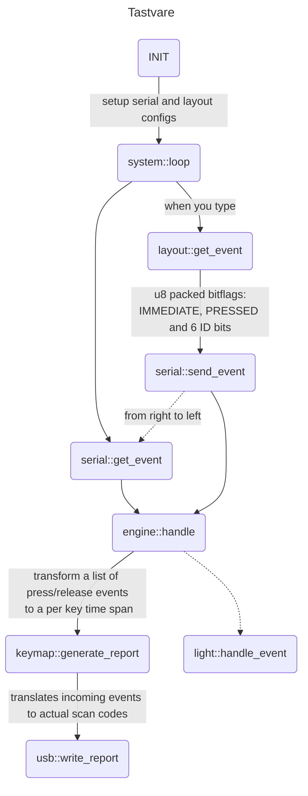

# tastvare 

Firmware is "fastvare" in norwegian, and we call a keyboard key a "tast". Tastvare it is.



## Testing

```bash
cargo test_pc --package tast
```

## TODO

- [ ] Write tests that run on machine and later on hardware
- [ ] Create an architecture diagram with mermaid

## Getting set up

See https://github.com/rp-rs/rp2040-project-template for getting started.

## Sketchbook

### Events

Here's the encoding scheme for the events.
They are always disambiguated, only one state is active per message. 

|BIT |ID       |Tinykeys | DESC |
|--- |---      |---      |---|
|8   |IMMEDIATE|0        | If 1 will not add to chord stack  |
|7   |PRESSED  |PRESSED  | Pressed `1` or released `0` event  |
|6   |ID5      |T2       | Thumb 2 state  |
|5   |ID4      |T1       | Thumb 1 state  |
|4   |ID3      |P        | Pinky state  |
|3   |ID2      |R        | Ring state  |
|2   |ID1      |M        | Middle state  |
|1   |ID0      |I        | Index state  |


This means that the following event stream could occur:

```
STACK  EVENT       #PRESSED  DESCRIPTION
+      0b01100000  1         Pinky pressed
+      0b01010000  2         Ring pressed
-      0b00100000  1         Pinky released
       0b11000001  1         Immediatly send key down for T2
+      0b01001000  2         Middle pressed
       0b10000001  1         Immediatly send key up for T2
-      0b00001000  1         Middle released
-      0b00010000  0         Ring released
```

Since we wait for the `#PRESSED` to fall back to 0 (neg edge) this entire stream means that the actual chord sent is Pinky+Ring+Middle.
This is the same as a `W` for the left hand on the [tinykeys](https://github.com/AlexanderBrevig/tinykeys).
